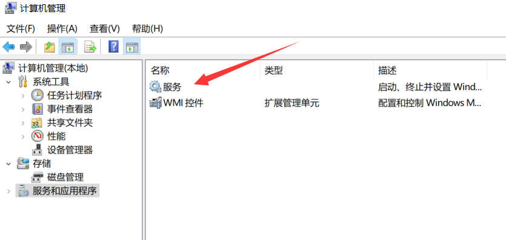
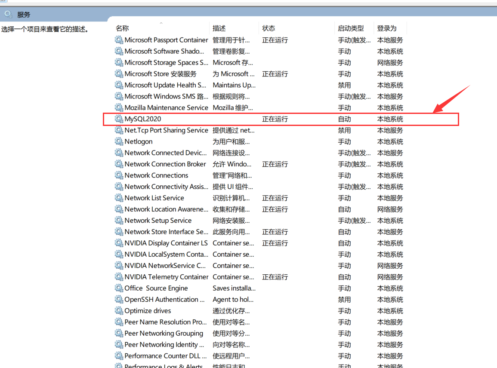
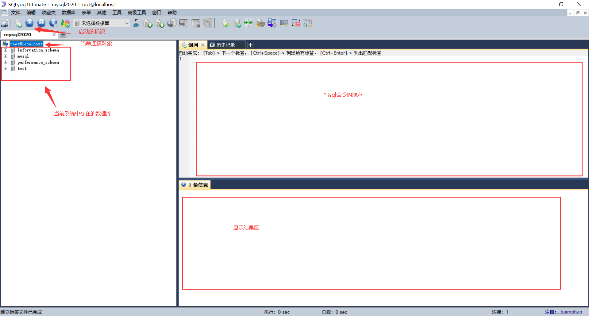

<a rel="license" href="http://creativecommons.org/licenses/by-nc-sa/4.0/"></a><br />本作品采用<a rel="license" href="http://creativecommons.org/licenses/by-nc-sa/4.0/">知识共享署名-非商业性使用-相同方式共享 4.0 国际许可协议</a>进行许可。

# 第一天的学习笔记

## 1.MySQL服务的启动和停止

- 第一种方式
  `windows10`系统下搜索框中搜索“计算机管理”，点进去后，点击*服务和应用程序*，点进去后再点击*服务*，然后找到自己的`MySQL名称`
     
     
     
     由于安装过程中会设置了开机自启，可以鼠标右键移到自己的`MySQL`那一栏点击*属性*，设置成手动启动。然后鼠标右键可以点击*停止/启动*
  
- 通过命令行方式

  打开`windows`的终端，即搜索*命令提示符*，然后鼠标右键选择*以管理员身份运行*

  由于我们安装的时候就已经配置好了环境变量，那么直接在终端中敲击命令

  ```shell
  # 启动服务名为 mysql2020 的服务
  net start mysql2020
  # 停止服务名为 mysql2020 的服务
  net stop mysql2020
  ```

##2.MySQL服务端的登录和退出

- 方式一：通过`MySQL`自带的客户端`MySQL 5.5 Command Line Client`进行登录退出，直接输入root的密码就算登录了，使用`exit`或者`ctrl`+`c`进行退出。该登录退出方式只能root用户使用。

- 方式二：通过windows自带的客户端

  ```mysql
  # 登录本地主机  3306 端口号的 root 用户,注意命令严格区分大小写
  # mysql 【-h主机名 -P端口号 】-u用户名 -p密码
  # -h 代表 -host    后面与主机名之间可以没有空格
  # -P 代表 -Port	 后面与端口号之间可以没有空格
  # -p后面与密码之间不能有空格
  mysql -h localhost -P 3306 -u root -p password
  # 也可以隐藏输入密码
  mysql -h localhost -P 3306 -u root -p
  # 上述命令回车后再输入密码，就密码不可见了
  
  # 直接连本机可以简写
  mysql -u root -ppassword
  # 退出：
  # exit或ctrl+C
  ```

  

## 3.MySQL的常见命令

这些常见的命令必须要先登录到`MySQL`服务后才有效，每条命令结尾以`g`或者`;`标记，推荐使用分号

```mysql
# 1.查看当前所有的数据库
show databases;
# 2.打开指定的库
use 库名
# 3.查看当前库的所有表
show tables;
# 4.查看其它库的所有表
show tables from 库名;
# 5.创建表
create table 表名(

	列名 列类型,
	列名 列类型，
	。。。
);
# 6.查看表结构
desc 表名;
# 7.查看服务器的版本
# 方式一：登录到mysql服务端
select version();
# 方式二：没有登录到mysql服务端
mysql --version
# 或，注意区分大小写
mysql -V

```
## 4.MySQL的语法规范

1. 不区分大小写,但建议关键字大写，表名、列名小写
2. 每条命令最好用分号结尾
3. 每条命令根据需要，可以进行缩进 或换行
4. 注释
   	单行注释：#注释文字
   	单行注释：-- 注释文字 注意--后面有一个空格
   	多行注释：/* 注释文字  */

## 5.SQLyog的使用

- 傻瓜式安装，直接下一步

- 点*新建*，本地主机地址就填`localhost`，用户名为`root`，密码为`MySQL`初始化时设置的`root`的密码，数据/库默认什么都不写就是各种数据库都包含进来了，然后点击*连接*



`SQLyog`中会自动将关键字转换为大写

## 6.SQL语言的分类

1. `DQL（Data Query Language）`：数据查询语言
   	select 
2. `DML(Data Manipulate Language)`:数据操作语言
   	insert 、update、delete
3. `DDL（Data Define Languge`：数据定义语言
   	create、drop、alter
4. `TCL（Transaction Control Language）`：事务控制语言
   	commit、rollback

## 7.DQL数据查询语言的学习

### 1.练习表属性描述

文件`myemployees.sql`

```mysql
departments		部门表
	department_id	部门编号
	department_name	部门名称
	manager_id		部门领导的员工编号
	location_id		位置编号

employees		员工表
	employee_d 		员工编号
	first_name		名
	last_name		姓
	email			邮箱
	phone_number	电话号码
	job_id			工种编号
	salary			月薪
	commission_pct	奖金率
	manager_id		上级领导的员工编号
	deparment_id	部门编号
	hiredate		入职日期
	
location		位置表
	location_id		位置编号
	street_address	街道
	postal_code		邮编
	city			城市
	state_province	州/省
	country_id		国家编号
	
jobs			工种
	job_id			工种编号
	job_title		工种名称
	min_salary		最低工资
	max_salary		最高工资
```

### 2.基础查询

语法：
`select` 查询列表` from` 表名;

类似于：`System.out.println(打印东西);`

特点：

1、查询列表可以是：表中的字段、常量值、表达式、函数
2、查询的结果是一个虚拟的表格
```mysql
USE myemployees;
```
1.查询表中的单个字段

```mysql
SELECT last_name FROM employees;
```
2.查询表中的多个字段
```mysql
SELECT last_name,salary,email FROM employees;
```
3.查询表中的所有字段
方式一：
```mysql
SELECT 
    `employee_id`,
    /* 注意不是单引号，而是简单上方数字1的左边的那个键盘
    目的是为了标注这是字段而不是关键词，强调作用。
    因为可能有的字段与关键字恰好是重合的*/
    `first_name`,
    `last_name`,
    `phone_number`,
    `last_name`,
    `job_id`,
    `phone_number`,
    `job_id`,
    `salary`,
    `commission_pct`,
    `manager_id`,
    `department_id`,
    `hiredate` 
FROM
    employees ;
```
方式二：
```mysql
 SELECT * FROM employees;
```
 4.查询常量值
```mysql
 SELECT 100;
 SELECT 'john';
```

 5.查询表达式
```mysql
 SELECT 100%98;
```
 6.查询函数
```mysql
 SELECT VERSION();
```

 7.起别名

 ①便于理解
 ②如果要查询的字段有重名的情况，使用别名可以区分开来


 方式一：使用as
```mysql
SELECT 100%98 AS 结果;
SELECT last_name AS 姓,first_name AS 名 FROM employees;
```
方式二：使用空格
```mysql
SELECT last_name 姓,first_name 名 FROM employees;
```

案例：查询salary，显示结果为 out put
由于out put之间有空格，会引起歧义，所以用引号包起来
`SQL`更推荐单引号

```mysql
SELECT salary AS "out put" FROM employees;
```

8.去重 DISTINCT

案例：查询员工表中涉及到的所有的部门编号
```mysql
SELECT DISTINCT department_id FROM employees;
```

9.+号的作用

`java`中的+号：
①运算符，两个操作数都为数值型
②连接符，只要有一个操作数为字符串

`mysql`中的+号：
仅仅只有一个功能：运算符

```mysql
select 100+90; # 两个操作数都为数值型，则做加法运算
select '123'+90;# 只要其中一方为字符型，试图将字符型数值转换成数值型
				#如果转换成功，则继续做加法运算
select 'john'+90;#	如果转换失败，则将字符型数值转换成0

select null+10; #只要其中一方为null，则结果肯定为null

```
连接多个字段采用函数 `CONCAT(exp1,exp2,...)`
案例：查询员工名和姓连接成一个字段，并显示为 姓名

```mysql
SELECT CONCAT('a','b','c') AS 结果;

SELECT 
	CONCAT(last_name,first_name) AS 姓名
FROM
	employees;
```

### 3.条件查询

语法：
	select 
		查询列表
	from
		表名
	where
		筛选条件;

分类：
一、按条件表达式筛选

简单条件运算符：> < = != <> >= <=
<>为`sql`的不等于

二、按逻辑表达式筛选
逻辑运算符：
作用：用于连接条件表达式
&& || !
and or not

&&和and：两个条件都为true，结果为true，反之为false
||或or： 只要有一个条件为true，结果为true，反之为false
!或not： 如果连接的条件本身为false，结果为true，反之为false

三、模糊查询
like
between and
in
is null


一、按条件表达式筛选

案例1：查询工资>12000的员工信息
```mysql
SELECT 
	*
FROM
	employees
WHERE
	salary>12000;
```


案例2：查询部门编号不等于90号的员工名和部门编号
```mysql
SELECT 
	last_name,
	department_id
FROM
	employees
WHERE
	department_id<>90;
```

二、按逻辑表达式筛选

案例1：查询工资z在10000到20000之间的员工名、工资以及奖金
```mysql
SELECT
	last_name,
	salary,
	commission_pct
FROM
	employees
WHERE
	salary>=10000 AND salary<=20000;
```
案例2：查询部门编号不是在90到110之间，或者工资高于15000的员工信息
```mysql
SELECT
	*
FROM
	employees
WHERE
	NOT(department_id>=90 AND  department_id<=110) OR salary>15000;
```
三、模糊查询

like


between and
in
is null
is not null

1.`like`

特点：
①一般和通配符搭配使用
	通配符：
	% 任意多个字符,包含0个字符
	_ 任意单个字符
	如果需要使用_来匹配，就需要转义，即`\_`
②LIKE在5.5以上版本也可以判断数值型，比如获取100-199的数据
LIKE '1__'


案例1：查询员工名中包含字符a的员工信息
```mysql
select 
	*
from
	employees
where
	last_name like '%a%';#abc
```
案例2：查询员工名中第三个字符为e，第五个字符为a的员工名和工资
```mysql
select
	last_name,
	salary
FROM
	employees
WHERE
	last_name LIKE '__n_l%';
```


案例3：查询员工名中第二个字符为_的员工名
```mysql
SELECT
	last_name
FROM
	employees
WHERE
	last_name LIKE '_$_%' ESCAPE '$';
```
`mysql`更推荐用 ESCAPE 来转义而不是反斜线

2.`between and`

①使用between and 可以提高语句的简洁度
②包含临界值
③两个临界值不要调换顺序


案例1：查询员工编号在100到120之间的员工信息
```mysql
SELECT
	*
FROM
	employees
WHERE
	employee_id >= 120 AND employee_id<=100;
#----------------------
SELECT
	*
FROM
	employees
WHERE
	employee_id BETWEEN 120 AND 100;
```
3.`in`

含义：判断某字段的值是否属于in列表中的某一项
特点：
	①使用in提高语句简洁度
	②in列表的值类型必须一致或兼容
	③in列表中不支持通配符
	`IN(exp1,exp2,exp3,...)`

案例：查询员工的工种编号是` IT_PROG`、`AD_VP`、`AD_PRES`中的一个员工名和工种编号
```mysql
SELECT
	last_name,
	job_id
FROM
	employees
WHERE
	job_id = 'IT_PROT' 
OR 
	job_id = 'AD_VP'
OR 
	JOB_ID ='AD_PRES';


#------------------

SELECT
	last_name,
	job_id
FROM
	employees
WHERE
	job_id IN( 'IT_PROT' ,'AD_VP','AD_PRES');
```
4、`is null`

=或<>不能用于判断null值
`is null`或`is not null` 可以判断null值

案例1：查询没有奖金的员工名和奖金率
```mysql
SELECT
	last_name,
	commission_pct
FROM
	employees
WHERE
	commission_pct IS NULL;

```
案例1：查询有奖金的员工名和奖金率
```mysql
SELECT
	last_name,
	commission_pct
FROM
	employees
WHERE
	commission_pct IS NOT NULL;

#----------以下为×
SELECT
	last_name,
	commission_pct
FROM
	employees

WHERE 
	salary IS 12000;
# 注意上述写法是错误的	
```
安全等于  <=>，可以与NULL来一起比较
缺点是缺少可读性


案例1：查询没有奖金的员工名和奖金率
```mysql
SELECT
	last_name,
	commission_pct
FROM
	employees
WHERE
	commission_pct <=>NULL;
```

案例2：查询工资为12000的员工信息
```mysql
SELECT
	last_name,
	salary
FROM
	employees

WHERE 
	salary <=> 12000;
```

is null pk <=>

IS NULL:仅仅可以判断NULL值，可读性较高，建议使用
<=>    :既可以判断NULL值，又可以判断普通的数值，可读性较低

###4.排序查询

语法：
select 查询列表
from 表名
【where  筛选条件】
order by 排序的字段或表达式;

特点：
1、`asc`代表的是升序，可以省略，英文为ascend
`desc`代表的是降序，英文为descend

2、order by子句可以支持 单个字段、别名、表达式、函数、多个字段

3、order by子句在查询语句的最后面，除了limit子句


1、按单个字段排序
```mysql
SELECT * FROM employees ORDER BY salary DESC;
```

2、添加筛选条件再排序

案例：查询部门编号>=90的员工信息，并按员工编号降序
```mysql
SELECT *
FROM employees
WHERE department_id>=90
ORDER BY employee_id DESC;
```

3、按表达式排序
案例：查询员工信息 按年薪降序

```mysql
SELECT *,salary*12*(1+IFNULL(commission_pct,0))
FROM employees
ORDER BY salary*12*(1+IFNULL(commission_pct,0)) DESC;
```

4、按别名排序
案例：查询员工信息 按年薪升序

```mysql
SELECT *,salary*12*(1+IFNULL(commission_pct,0)) 年薪
FROM employees
ORDER BY 年薪 ASC;
```
5、按函数排序
案例：查询员工名，并且按名字的长度降序
```mysql
SELECT LENGTH(last_name),last_name 
FROM employees
ORDER BY LENGTH(last_name) DESC;
```
6、按多个字段排序

案例：查询员工信息，要求先按工资降序，再按employee_id升序
```mysql
SELECT *
FROM employees
ORDER BY salary DESC,employee_id ASC;
```

### 5.常见函数

功能：类似于`java`中的方法

好处：提高重用性和隐藏实现细节

调用：select 函数名(实参列表) [form 表];

特点：

​	①叫什么（函数名）

​	②干什么（函数功能）

分类：
	1、单行函数
	如 `concat`、`length`、`ifnull`等，

​	2、分组函数
​	功能：做统计使用，又称为统计函数、聚合函数、组函数


1. 字符函数

| 字符函数                | 功能                                                   |
| ----------------------- | ------------------------------------------------------ |
| `LENGTH（R）`           | 获取参数值R的字节个数                                  |
| `CONCAT(exp1,exp2,...)` | 拼接字符串                                             |
| `UPPER(R)`              | 将R变成大写                                            |
| `LOWER(R)`              | 将R变成小写                                            |
| `SUBSTR(str,pos)`       | 索引从1开始，截取`str`指定`pos`索引处后面的所有字符    |
| `SUBSTR(str,pos,len)`   | 索引从1开始，截取`str`指定`pos`索引处后面的`len`个字符  |
| `INSTR(str,substr)` | 索引从1开始，返回`str`中子串`substr`的索引，找不到就返回0 |
| `TRIM（str）` | 去掉`str`首尾的空格 |
| `LPAD(str,len,padstr)` | 用指定的字符`padstr`实现对`str`的左填充达到共`len`个字符 |
| `RPAD(str,len,padstr)` | 用指定的字符`padstr`实现对`str`的右填充达到共`len`个字符 |
| `REPLACE(str,from_str,to_str)` | 将字符串`str`中的所有`from_str`替换为`to_str` |

2. 数学函数

| 数学函数        | 功能                                     |
| --------------- | ---------------------------------------- |
| `ROUND(X)`      | 对`X`进行四舍五入                        |
| `ROUND(X,D)`    | 对`X`进行四舍五入并保留`D`位小数         |
| `CEIL(X)`       | 对`X`进行向上取整，返回` ≥ X`的最小整数  |
| `FLOOR(X)`      | 对`X`进行向下取整，返回`  ≤ X`的最小整数 |
| `TRUNCATE(X,D)` | 对`X`进行截断，只保留`D`位               |
| `MOD`(X,Y)      | 求`X%Y`，结果符号跟着`X`走               |

3. 日期函数

| 日期函数                   | 功能                                           |
| -------------------------- | ---------------------------------------------- |
| `NOW()`                    | 返回当前系统的日期+时间                        |
| `CURDATE()`                | 返回当前系统的日期，不包含时间                 |
| `CURTIME()`                | 返回当前系统的时间，不包含日期                 |
| `YEAR()`                   | 获取年份                                       |
| `MONTH()`                  | 获取月份                                       |
| `MONTHNAME()`              | 获取月份对应的英文单词                         |
| `STR_TO_DATE(str,format)`  | 将字符串`str`通过指定的格式`format`转换为日期  |
| `DATE_FORMAT(date,format)` | 将日期`date`通过指定的格式`format`转换为字符串 |

4. 其他函数

| 其他函数     | 功能                   |
| ------------ | ---------------------- |
| `VERSION()`  | 返回当前数据库的版本   |
| `DATABASE()` | 返回当前所在的数据仓库 |
| `USER()`     | 返回当前的用户名       |

5. 流程控制函数

   - `IF`函数，`if else`的效果

   ```mysql
   SELECT IF(10<5,'大','小');
   
   SELECT last_name,commission_pct,IF(commission_pct IS NULL,'没奖金，呵呵','有奖金，嘻嘻') 备注
   FROM employees;
   ```

   

   - `case`函数

   方式一：`switch case`的效果

   `java`中
   switch(变量或表达式){
   	case 常量1：语句1;break;
   	...
   	default:语句n;break;


   }

   `mysql`中

   case 要判断的字段或表达式
   when 常量1 then 要显示的值1或语句1;
   when 常量2 then 要显示的值2或语句2;
   ...
   else 要显示的值n或语句n;
   end
   */

   ```mysql
   /*案例：查询员工的工资，要求
   
   部门号=30，显示的工资为1.1倍
   部门号=40，显示的工资为1.2倍
   部门号=50，显示的工资为1.3倍
   其他部门，显示的工资为原工资
   
   */
   SELECT salary 原始工资,department_id,
   CASE department_id
   WHEN 30 THEN salary*1.1
   WHEN 40 THEN salary*1.2
   WHEN 50 THEN salary*1.3
   ELSE salary
   END AS 新工资
   FROM employees;
   ```

   方式二：类似多重`if`
   `java`中：
   if(条件1){
   	语句1；
   }else if(条件2){
   	语句2；
   }
   ...
   else{
   	语句n;
   }

   `mysql`中：

   case 
   when 条件1 then 要显示的值1或语句1
   when 条件2 then 要显示的值2或语句2
   。。。
   else 要显示的值n或语句n
   end
   */

   ```mysql
   /*案例：查询员工的工资的情况
   如果工资>20000,显示A级别
   如果工资>15000,显示B级别
   如果工资>10000，显示C级别
   否则，显示D级别
   */
   
   
   SELECT salary,
   CASE 
   WHEN salary>20000 THEN 'A'
   WHEN salary>15000 THEN 'B'
   WHEN salary>10000 THEN 'C'
   ELSE 'D'
   END AS 工资级别
   FROM employees;
   ```

   ### 6.连接查询

含义：又称多表查询，当查询的字段来自于多个表时，就会用到连接查询

笛卡尔乘积现象：表1 有m行，表2有n行，结果=m*n行

发生原因：没有有效的连接条件
如何避免：添加有效的连接条件

分类：

按年代分类：
`sql92`标准:仅仅支持内连接
`sql99`标准【推荐】：支持内连接+外连接（左外和右外）+交叉连接

按功能分类：
	内连接：
		等值连接
		非等值连接
		自连接
	外连接：
		左外连接
		右外连接
		全外连接
	交叉连接


一、`sql92`标准

（1）等值连接

① 多表等值连接的结果为多表的交集部分
② n表连接，至少需要n-1个连接条件
③ 多表的顺序没有要求
④ 一般需要为表起别名
⑤ 可以搭配前面介绍的所有子句使用，比如排序、分组、筛选

案例1：查询女神名和对应的男神名

```mysql
SELECT NAME,boyName 
FROM boys,beauty
WHERE beauty.boyfriend_id= boys.id;
```


案例2：查询员工名和对应的部门名

```mysql
SELECT last_name,department_name
FROM employees,departments
WHERE employees.`department_id`=departments.`department_id`;
```


1. 为表起别名

① 提高语句的简洁度
② 区分多个重名的字段

**注意：如果为表起了别名，则查询的字段就不能使用原来的表名去限定**

案例：查询员工名、工种号、工种名

```mysql
SELECT e.last_name,e.job_id,j.job_title
FROM employees  e,jobs j
WHERE e.`job_id`=j.`job_id`;
```


2. 两个表的顺序 *是否* 可以调换

案例：查询员工名、工种号、工种名

```mysql
SELECT e.last_name,e.job_id,j.job_title
FROM jobs j,employees e
WHERE e.`job_id`=j.`job_id`;
```


3. 可以加筛选

案例1：查询有奖金的员工名、部门名

```mysql
SELECT last_name,department_name,commission_pct
FROM employees e,departments d
WHERE e.`department_id`=d.`department_id`
AND e.`commission_pct` IS NOT NULL;
```


案例2：查询城市名中第二个字符为o的部门名和城市名

```mysql
SELECT department_name,city
FROM departments d,locations l
WHERE d.`location_id` = l.`location_id`
AND city LIKE '_o%';
```


4. 可以加分组

案例1：查询每个城市的部门个数

```mysql
SELECT COUNT(*) 个数,city
FROM departments d,locations l
WHERE d.`location_id`=l.`location_id`
GROUP BY city;
```


案例2：查询有奖金的每个部门的部门名和部门的领导编号和该部门的最低工资

```mysql
SELECT department_name,d.`manager_id`,MIN(salary)
FROM departments d,employees e
WHERE d.`department_id`=e.`department_id`
AND commission_pct IS NOT NULL
GROUP BY department_name,d.`manager_id`;
```


5. 可以加排序

案例：查询每个工种的工种名和员工的个数，并且按员工个数降序

```mysql
SELECT job_title,COUNT(*)
FROM employees e,jobs j
WHERE e.`job_id`=j.`job_id`
GROUP BY job_title
ORDER BY COUNT(*) DESC;
```


6. 可以实现三表连接

案例：查询员工名、部门名和所在的城市

```mysql
SELECT last_name,department_name,city
FROM employees e,departments d,locations l
WHERE e.`department_id`=d.`department_id`
AND d.`location_id`=l.`location_id`
AND city LIKE 's%'
ORDER BY department_name DESC;
```


（2）非等值连接

案例1：查询员工的工资和工资级别

```mysql
SELECT salary,grade_level
FROM employees e,job_grades g
WHERE salary BETWEEN g.`lowest_sal` AND g.`highest_sal`
AND g.`grade_level`='A';
```


（3）自连接

案例：查询 员工名和上级的名称

```mysql
SELECT e.employee_id,e.last_name,m.employee_id,m.last_name
FROM employees e,employees m
WHERE e.`manager_id`=m.`employee_id`;
```

