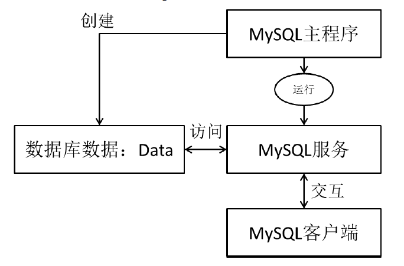

 本作品采用<a rel="license" href="http://creativecommons.org/licenses/by-nc-sa/4.0/">知识共享署名-非商业性使用-相同方式共享 4.0 国际许可协议</a>进行许可。

# 开始之前

## 1.使用数据库的好处

1. 可以持续化数据到本地
2. 结构化查询

## 2.数据库的常见概念

1. **DB**（database）：存储数据的“仓库”。它保存了一系列有组织的数据。
2. **DBMS**（Database Management System）：数据库管理系统，又称为数据库软件或数据库产品，用于创建或管理DB
3. **SQL**：结构化查询语言，用于和数据库通信的语言，不是某个数据库软件特有的，而是几乎所有的主流数据库软件通用的语言。

## 3.SQL的优点

1. 不是某个特定数据库供应商专有的语言，几乎所有DBMS都支持SQL
2. 简单易学
3. 虽然简单，但实际上是一种强有力的语言，灵活使用其语言元素，可以进行非常复杂和高级的数据库操作。

## 4.数据库存储数据的特点

1. 数据存放到表中，然后表再放到库中
2. 一个库中可以有多张表，每张表具有唯一的表名用来标识自己
3. 表中有一个或多个列，列又称为“字段”，相当于java中“属性”
4. 表中的每一行数据，相当于java中“对象”

## 5.常见的数据库管理系统

`mysql`、`oracle`、`db2`、`sqlserver`

## 6.Mysql程序结构

## 7.安装过程中出现的问题

1. 安装失败

尝试把安装目录内的`bin`目录下的`MySQLInstanceConfig.exe`双击后重新配置下。

2. 卸载

常规卸载方法之后，还需要找到当时安装`mysql`的安装路径，把整个文件夹删掉。同时找到C盘下的隐藏文件`ProgramData`，把里面的的`MySql`文件夹删掉

3. 经过上述卸载后重装依然不能安装成功，就需要网上查询对注册表的清理，然后再重新安装新版的`MySql`

4. 初始化的程序在`MySql`的安装目录下的`bin`下的`MySQLInstanceConfig.exe`

> 初始化，选择默认的精确配置，即 Detailed Configuration
>
> 选择默认的开发机器（耗用的内存最小，往下面的选项越来越大），即Develop Machine
>
> 多功能型数据库，事务型数据库，非事务型数据库，默认选择多功能型，即`Mutifunctional Database`。数据库都有一个存储引擎，分为事务型存储引擎和非事务型存储引擎。而多功能型数据库这两重引擎速度都比较快，但是事务型数据库只是事务型存储引擎速度比较快，非事务型数据库只是非事务型存储引擎速度比较快
>
> 存储引擎的空间配置默认就好
>
> 允许同一时刻在线的并发数，一般默认其默认的20
>
> `MySql`默认的端口号是3306，实际开发中要修改端口号，防止别人对该默认端口号的攻击
>
> 在选择字符集的时候，第一个选项是标准英语，第二个选项是`utf8`，第三个是自定义，此处选择第三个，然后自定义字符集是`utf8`，在`MySql`中没有中间的`-`组成`utf-8`
>
> 取一个服务名，默认是`MySQL`，可以后面再加内容当作名字
>
> 一定要添加到环境变量勾选上`Include Bin Directory in Windows PATH`
>
> 设置root用户的密码，允许远程机访问勾选上
>
> 可以不用创建一些新用户，用root用户即可
>
> 
>
> 在`C:\Program Files\MySQL\MySQL Server 5.5`下有一个`my.ini`文件，通过记事本方式打开，里面记录的是`MySQL`的配置信息，而`[mysqld]`下面的是服务端的配置信息，结合`#`开头的注释依次是
>
> port端口号
>
> 安装目录
>
> 数据存储目录
>
> 字符集
>
> 数据库的存储引擎
>
> 语法模式
>
> 最大连接数
>
> **每次修改完配置文件后，数据库需要重新启动一下才能生效**

